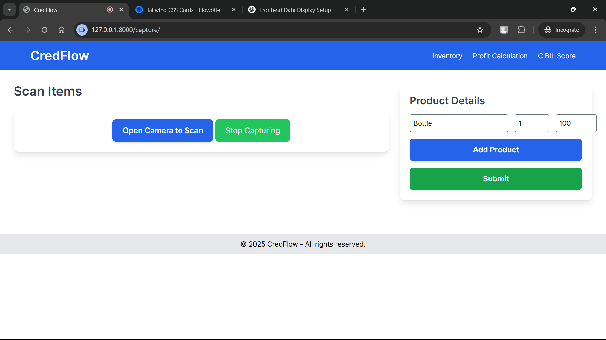
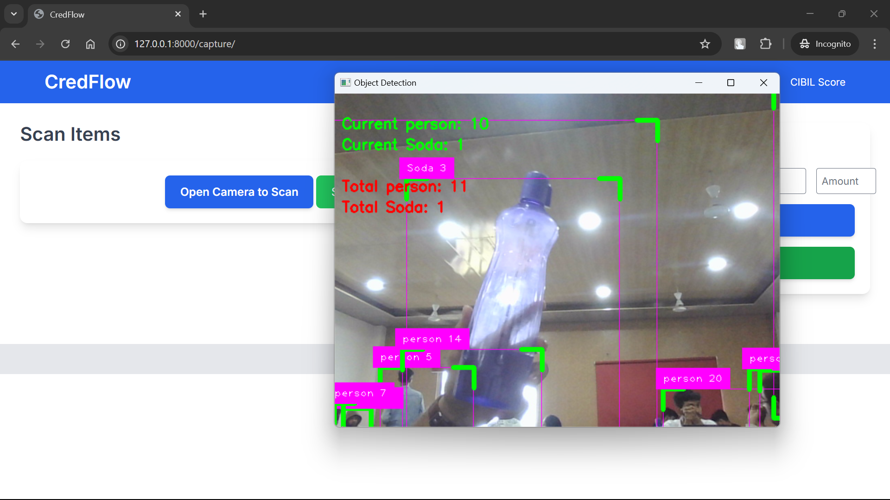

# Smart Business & Credit Management App

## Problem Statement
Small vendors and shopkeepers, especially in rural and semi-urban areas, struggle with managing inventory, tracking profits, handling credit (udhaari), and maintaining accurate financial records. Many still rely on manual registers or outdated methods, leading to errors, loss of records, and inefficient business operations. Additionally, tracking stock levels and identifying products can be time-consuming, affecting overall productivity.

## Solution
Our smart business and credit management app is designed to simplify financial tracking and inventory management for vendors and shopkeepers. It provides an easy-to-use dashboard that helps users:

- **Manage Inventory** – Keep real-time track of stock levels and detect items via scanning.
- **Track Profitability** – Get automated profit calculations for better financial planning.
- **Monitor Credit Transactions** – Easily record, manage, and track udhaari (credit amounts) to ensure timely settlements.
- **Simple & Intuitive Dashboard** – Provides a clear financial summary at a glance.
- **Scan-to-Detect Items** – Instantly identify and update inventory by scanning products.

## Features
- **User-friendly interface** for easy navigation.
- **Automated financial tracking** to reduce errors and improve efficiency.
- **Instant inventory updates** with barcode or QR scanning.
- **Secure data storage** to prevent loss of financial records.

## Impact
By digitizing business operations, our app empowers small vendors to:
- Reduce financial losses.
- Improve cash flow management.
- Enhance operational efficiency.
- Focus on growing their business with confidence.

## Screenshots
Here are some visuals showcasing key features of the app:

### Dashboard View

### Scan Page View

### Scanning Window

## Technologies Used
- **Frontend:** Html,Css,JavaScript
- **Backend:** Python , Django
- **Deep Learning:** Python , TensorFlow , OpenCV
 

 
   

## Contributors
- **Rudrasish Dutta** - Planning and developing AI
- **Soham Goswami** - Backend Integration and Object Detection
- **Sayak Dutta** - FrontEnd

## License
This project is licensed under the MIT License.

---
 

